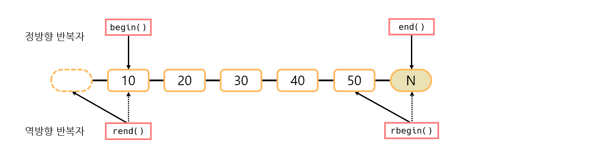
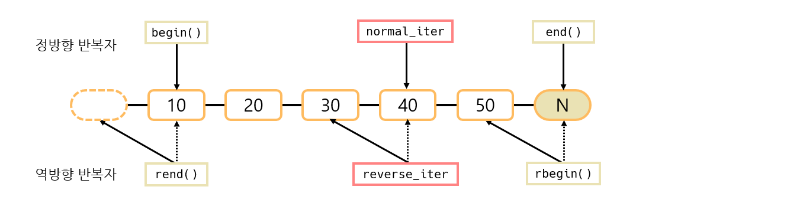
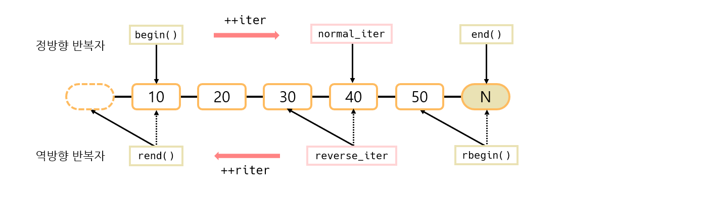

# What is STL
## 📝 목차
- [STL이란](https://github.com/choisb/Study-Cpp-STL/tree/master/Ch05_What_is_STL#-stl이란)
- [STL을 한눈에](https://github.com/choisb/Study-Cpp-STL/tree/master/Ch05_What_is_STL#-stl을-한눈에)
- [연습문제](https://github.com/choisb/Study-Cpp-STL/tree/master/Ch05_What_is_STL#-연습문제)
___
## ✔ STL이란
- STL은 표준 C++ 라이브러리의 일부분으로 (Standard Template Library)의 약자이다.

- STL은 프로그램에 필요한 자료구조와 알고리즘을 템플릿으로 제공한다.

- 또한, 자료구조와 알고리즘을 서로 반복자라는 구성 요소를 통해 연결한다.

- STL의 주요한 세가지 특성은 다음과 같다.
  - 효율성 
  - 일반화 프로그램(재사용성) 
  - 확장성
  
- STL의 구성요소는 다음과 같다.
  - 컨테이너
  - 반복자
  - 알고리즘
  - 함수 객체
  - 어댑터
  - 할당기 

[
[위로](https://github.com/choisb/Study-Cpp-STL/tree/master/Ch05_What_is_STL#what-is-stl) 
/ 
[처음으로](https://github.com/choisb/Study-Cpp-STL#c-stl-programming)
]
___
## ✔ STL을 한눈에
#### 📍 컨테이너
- **컨테이너란?**
  - 컨테이너는 같은 타입의 데이터를 저장, 관리할 목적으로 만들어진 클래스다.
  - 컨테이너의 종류는 성능이나 메모리 사용, 지원 인터페이스(알고리즘, 멤버 함수)등에 큰 차이를 보인다.
  
- **컨테이너 종류 (시퀀스 vs 연관)**
  - **표준 시퀀스 컨테이너:** 컨테이너 원소가 자신만의 삽입 위치(순서)를 가지는 컨테이너( `vector`, `deque`, `list`)
  - **표준 연관 컨테이너:** 저장 원소가 삽입 순서와 다르게 특정 정렬 기준에 의해 자동 정렬되는 컨테이너.(`set`, `multiset`, `map`, `multimap`)
 
- **컨테이너 종류 (배열 vs 노드)** 
  - **배열 기반 컨테이너:** 데이터 여러 개가 하나의 메모리 단위에 저장(`vector`, `deque`)
  - **노드 기반 컨테이너:** 데이터 하나를 하나의 메모리 단위에 저장.
  (`list`, `set`, `multiset`, `map`, `multimap`)

- **컨테이너의 사용 예시**
  - 예시로 `vector` 컨테이너를 사용한다.
    - `vector`는 시퀀스 컨테이너이므로 추가한 순서대로 출력된다.
    - `vector`는 배열 기반 컨테이너므로 `[]` 연산자로 저장 원소에 접근 할 수 있다.
    > 사용 예시는 소스코드 참고[(`ex05_01.cpp`)](https://github.com/choisb/Study-Cpp-STL/blob/master/Ch04_Template/ex05_01.cpp)


#### 📍 반복자
- **반복자란?** 
  - 반복자는 컨테이너에 저장된 원소를 순회하고 접근하는 일반화된 방법을 제공한다.
  - 반복자는 컨테이너와 알고리즘이 하나로 동작하게 묶어주는 인터페이스 역할을 한다.
  - 반복자 덕분에 알고리즘은 특정 컨테이너에 종속적이지 않고 독립적이면서도 언제든지 컨테이너와 결합하여 동작할 수 있다.

- **반복자의 종류**
  - **입력 반복자:** 현 위치의 원소를 한 번만 읽을 수 있다.
  - **출력 반복자:** 현 위치의 원소를 한 번만 쓸 수 있다.
  - **순방향 반복자:** 입력, 출력 반복자 기능에 순방향으로 이동`++`이 가능하다.
  - **양방향 반복자:** 순방향 반복자 기능에 역방향으로 이동`--`이 가능하다.
  - **임의 접근 반복자:** 양방향 반복자 기능에 `+`, `-`, `+=`, `-=`, `[]` 연산이 가능하다.

- **반복자의 특징**
  - 반복자는 컨테이너 내부의 원소를 가리키고 접근할 수 있어야 한다.(`*`연산자 제공)
  - 반복자는 다음 원소로 이동하고 컨테이너의 모든 원소를 순회할 수 있어야 한다.(`++`, `!=`, `==` 연산자 제공)

- **반복자의 사용 예시**
  > 사용예시는 소스코드 참고[(`ex05_02.cpp`)](https://github.com/choisb/Study-Cpp-STL/blob/master/Ch04_Template/ex05_02.cpp)

#### 📍 알고리즘
- **STL에서 알고리즘이란?**
  - STL이 순차열의 원소를 조사, 변경, 관리, 처리할 목적으로 제공하는 구성요소
  - 알고리즘은 한 쌍의 반복자([`begin`,`end`))를 필요로 한다.

- **알고리즘의 종류**
  - 원소를 수정하지 않는 알고리즘
  - 원소를 수정하는 알고리즘
  - 제거 알고리즘
  - 변경 알고리즘
  - 정렬 알고리즘
  - 정렬된 범위 알고리즘
  - 수치 알고리즘
  
- **알고리즘의 사용 예시**
  - 알고리즘은 특정 컨테이너나 원소 타입에 종속적이지 않다. 
  아래에서 `find` 알고리즘과 `sort`알고리즘을 예를 들어 설명한다.
   
    - `find`는 순방향 반복자를 요구하기 때문에 순방향 반복자만 지원하는 
    컨테이너라면 어떤 컨테이너가 와도 알고리즘을 수행할 수 있다.

    > `find` 알고리즘 예시 [(`ex05_03.cpp`)](https://github.com/choisb/Study-Cpp-STL/blob/master/Ch04_Template/ex05_03.cpp)
    ```cpp
        vector<int>::iterator iter;
        iter = find(v.begin(), v.end(), 20); // [begin, end) 에서 20 찾기
        cout << *iter << endl;
    ```

    - `sort` 알고리즘은 임의 접근 반복자를 요구하므로 `vector`와 `deque`는 `sort` 
    알고리즘을 수행할 수 있지만, `list`등 다른 컨테이너는 불가능 하다.
    
    >`sort` 알고리즘 예시 [(`ex05_04.cpp`)](https://github.com/choisb/Study-Cpp-STL/blob/master/Ch04_Template/ex05_04.cpp)
    ```cpp
        vector<int> v;
        v.push_back(10);
        v.push_back(20);

        list<int> lt;
        lt.push_back(10);
        lt.push_back(20);

        sort(v.begin(), v.end());   // 정렬 가능 (vector는 임의 접근 반복자)
        sort(lt.begin(), lt.end()); // 에러! (list는 양방향 반복자, 임의 접근 불가)
    ```

#### 📍 함수 객체
- **STL에서 함수 객체란?**

  - 클라이언트가 정의한 동작을 다른 구성 요소에 반영하려 할때 **함수 객체**가 사용된다.

  - 함수 객체를 사용하면 STL 구성 요소를 더욱 유연하게 사용할 수 있다.
    - 많은 STL 알고리즘이 함수 객체, 함수, 함수 포인터 등의 함수류를 인자로 받아 알고리즘을 유연하게 동작시키고 있다.

- **함수 객체 사용 예시**
  > `less`, `greater` 함수 객체 사용 예시 [(`ex05_05.cpp`)](https://github.com/choisb/Study-Cpp-STL/blob/master/Ch04_Template/ex05_05.cpp) 
    ```cpp
        ...
        sort(v.begin(), v.end(), less<int>()); // 오름차순 정렬
        for (vector<int>::iterator iter = v.begin(); iter != v.end(); ++iter)
            cout << *iter << " ";
        cout << endl;

        sort(v.begin(), v.end(), greater<int>()); // 내림차순 정렬
        for (vector<int>::iterator iter = v.begin(); iter != v.end(); ++iter)
            cout << *iter << " ";
        cout << endl;
        ...
    ```
  - 함수 객체 `less`, `greater`를 활용해서 `sort` 
  **알고리즘을 유연하게**(오름차순 or 내림차순) 동작시키는 모습을 볼 수 있다.

#### 📍 어댑터
- **STL에서 어댑터란?**
  - 어뎁터는 구성 요소의 **인터페이스를 변경**한다.

- **어댑터의 종류**
  - 컨테이너 어댑터: `stack`, `queue`, `priority_queue`
  - 반복자 어댑터: `reverse_iterator`, `back_insert_iterator`, `front_insert_iterator`, `insert_iterator`
  - 함수 어댑터: 바인더(`binder`), 부정자(`negator`), 함수 포인터 어댑터(adaptor for pointers to functions)

- **컨테이너 어댑터의 사용 예시**
  - 대표적인 컨테이너 어댑터가 `stack`이다. `stack` 어댑터는 다음과 같은 특징을 가진다.
  
    - 일반 컨테이너를 `LIFO` 방식의 스택 컨테이너로 변환.
    - `empty`, `size`, `push_back`, `pop_back`, `back` 인터페이스를 지원하는 컨테이너에 모두 적용할 수 있다.
    - 시퀀스 컨테이너는 모두 해당 멤버 함수를 가지므로 stack 컨테이너 어댑터의 컨테이너로 이용할 수 있다.

  - `stack`은 기본적으로 `deque` 컨테이너를 이용한다. 여기서는 컨테이너 어뎁터를 활용해서 `vector`컨테이너를
  이용하는 `stack`을 구현한다.
  > `stack` 컨테이너 어댑터 [(`ex05_06.cpp`)](https://github.com/choisb/Study-Cpp-STL/blob/master/Ch04_Template/ex05_06.cpp)
    ```cpp
        ...
        // 일반적인 stack의 사용 방법 ////
        // stack은 디폴트 컨테이너로 deque<int>를 사용한다.
        stack<int> st;
        st.push(10);
        st.push(20);
        ...

        // 컨테이너 어댑터로 stack의 사용 방법 ////
        // 컨테이너 어댑터를 활용하면 stack의 컨테이너를 vector<int>로 사용할 수 있다.
        stack<int, vector<int>> ast; // vector 컨테이너를 이용한 stack 컨테이너 생성
 
        ast.push(10);
        ast.push(20);
        ...
    ``` 

- **반복자 어댑터의 사용 예시**
  - 대표적인 반복자 어댑터는 `revers_iterator`이다. `revers_iterator`어댑터는 다음과 같은 특징을 가진다.
    - 일반 반복자의 동작방식을 반대로 동작시키는 역방향 반복자로 변환한다.
      > 역방향 반복자 [(`ex05_07.cpp`)](https://github.com/choisb/Study-Cpp-STL/blob/master/Ch04_Template/ex05_07.cpp)
        ```cpp
            ...
            // 정방향으로 출력하는 일반 반복자
            for (vector<int>::iterator iter = v.begin(); iter != v.end(); ++iter)
                cout << *iter << " ";
            cout << endl;

            // 일반 반복자 iterator를 역방향 반복자 reverse_iterator로 변환
            reverse_iterator<vector<int>::iterator> riter (v.end());
            reverse_iterator<vector<int>::iterator> end_riter(v.begin());

            // 정방향 반복자 iter과 반대로 동작한다.
            for (; riter != end_riter; ++riter)
                cout << *riter << " ";
            cout << endl;
            ...
        ```


    - `revers_iterator` 반복자가 가리키는 실제 원소의 값은 항상 다음 원소의 값이다.
    
    - 예제를 통해서 이를 살펴보도록 하자.
      > 정방향 반복자와 역방향 반복자가 가리키는 값[(`ex05_08.cpp`)](https://github.com/choisb/Study-Cpp-STL/blob/master/Ch04_Template/ex05_08.cpp)
        ```cpp
            int main()
            {
                vector<int> v;

                v.push_back(10);
                v.push_back(20);
                v.push_back(30);
                v.push_back(40);
                v.push_back(50);

                //40을 가리키는 반복자    
                vector<int>::iterator normal_iter = v.begin() + 3;
    
                // normal_iter의 역방향 반복자
                vector<int>::reverse_iterator reverse_iter(normal_iter);

                cout << "정방향 반복자의 값: " << *normal_iter << endl;
                cout << "역방향 반복자의 값: " << *reverse_iter << endl;
                cout << endl;
            ...
        ```
    - 이 코드를 그림으로 나타내면 다음과 같다.
    
      > 출력 결과
        ```
        정방향 반복자의 값: 40
        역방향 반복자의 값: 30
        ```
    - 이렇게 설계한 이유는 정방향 반복자의 `end()` 값이 빈값을 가리키고 있기 때문이다.
    - 덕분에 `++`연산만으로도 정방향 역방향 순회가 정상적으로 가능하다.
    
      > 정방향 반복자와 역방향 반복자가 가리키는 값[(`ex05_08.cpp`)](https://github.com/choisb/Study-Cpp-STL/blob/master/Ch04_Template/ex05_08.cpp)
        ```cpp
        ...
            for (vector<int>::iterator iter = v.begin(); iter != normal_iter; ++iter)
                cout << *iter << " ";
            cout << endl;

            for (vector<int>::reverse_iterator riter = reverse_iter; riter != v.rend(); ++riter)
                cout << *riter << " ";
            cout << endl;

            return 0;
        }
        ```
    - 이 코드를 그림으로 나타내면 다음과 같다.
    
      > 출력 결과
        ```
        10 20 30
        30 20 10
        ```

- **함수 어댑터의 사용 예시**
  - 대표적인 함수 어댑터는 `not2`이다. 
  - `not2`는 조건자 함수 객체를 반대 의미의 조건자 함수 객체로 변경하는 어댑터이다.
  - `not1`은 단항 조건자에 `not2`는 이항 조건자에 사용된다.
    > 사용예시는 소스코드 참고[(`ex05_09.cpp`)](https://github.com/choisb/Study-Cpp-STL/blob/master/Ch04_Template/ex05_09.cpp)

#### 📍 할당기
- **할당기란?**
  - 할당기는 컨테이너의 메모리 할당 정보와 정책을 캡슐화한 STL 구성 요소.
  
  - 할당기는 템플릿 클래스이며 모든 컨테이너는 기본 할당기를 사용한다.
  
  - STL의 할당기를 사용자가 직접 정의하고 사용할 수 있다.
    - 사용자 정의 할당기는 사용자가 직저 메모리 할당 방식을 제어할 수 있게 한다.
    - 다중 스레드에 최적화되고 안전한 사용자 메모리 할당 모델이 필요하거나 사용자가 컨테이너에 맞는
    메모리 할당 모델을 설계하거나 특정 구현 환경에서 최적화된 메모리 할당 모델을 구축할 떄 등에 사용됨.
  
  - 프로그램 대부분은 STL에서 제공하는 **기본 할당기만으로 충분**하므로 우리는 할당기를 자세히 다루지는 않음.
  
- **할당기 사용 예시**
  - `vector`와 `set`컨테이너에 기본 할당기를 직접 지정하는 예제
  > 컨테이너 기본 할당기 [(`ex05_10.cpp`)](https://github.com/choisb/Study-Cpp-STL/blob/master/Ch04_Template/ex05_10.cpp)

[
[위로](https://github.com/choisb/Study-Cpp-STL/tree/master/Ch05_What_is_STL#what-is-stl) 
/ 
[처음으로](https://github.com/choisb/Study-Cpp-STL#c-stl-programming)
]
___
## 🎯 연습문제
##### 1. 다음 빈 칸을 채우세요.
- 컨테이너
- 반복자
- 알고리즘

##### 2. 다음 빈 칸을 채우세요.
- 시퀀스 컨테이너
- 연관 컨테이너

##### 3. 다음 빈 칸을 채우세요.
- 임의 접근
- 양방향 접근
- 순차열
- 순차열
 
##### 4. 다음 구간의 순차열을 쓰세요.
- A, B, C, D,
- A, B
- C, D

##### 5. 다음 중 양방향 반복자가 지원하지 않는 연산자를 고르세요.
- `[]` / `+=` / `-=`

##### 6. 다음 빈 칸을 채우세요.
- `begin()`
- `end()`
- `*`

##### 7. 다음 빈 칸을 채우세요.
- 어댑터
- 컨테이너 어댑터
- 반복자 어댑터
- 함수 어댑터

[
[위로](https://github.com/choisb/Study-Cpp-STL/tree/master/Ch05_What_is_STL#what-is-stl) 
/ 
[처음으로](https://github.com/choisb/Study-Cpp-STL#c-stl-programming)
]
___

## 🏷 출처
- 본 프로젝트는 개인 학습을 목적으로 공동환 저자의 [뇌를 자극하는 C++ STL](한빛 미디어) 교재 내용을 요약 및 일부 수정하여 작성하였습니다.
- 본 프로젝트의 내용과 코드에 대한 저작권은 공동환과 한빛미디어(주)에 있으며, 한빛미디어(주)로 부터 허가를 받고 게시하였음을 밝힙니다.
- [도서 소개보기](https://www.hanbit.co.kr/store/books/look.php?p_code=B5912645820)

[
[위로](https://github.com/choisb/Study-Cpp-STL/tree/master/Ch05_What_is_STL#what-is-stl) 
/ 
[처음으로](https://github.com/choisb/Study-Cpp-STL#c-stl-programming)
]
___