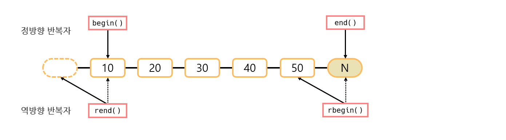

# Iterator
## 📝 목차
- [반복자란](https://github.com/choisb/Study-Cpp-STL/tree/master/Ch10_Iterator#-반복자란)
- [정방향 반복자와 역방향 반복자](https://github.com/choisb/Study-Cpp-STL/tree/master/Ch10_Iterator#-정방향-반복자와-역방향-반복자)
- [기타 반복자](https://github.com/choisb/Study-Cpp-STL/tree/master/Ch10_Iterator#-기타-반복자)
- [반복자 특성과 보조 함수](https://github.com/choisb/Study-Cpp-STL/tree/master/Ch10_Iterator#-반복자-특성과-보조-함수)

___
## ✔ 반복자란
- **반복자란?**
  - 반복자는 포인터를 추상화한 클래스 객체.
  - 포인터가 하지 못하는 더 많은 동작을 수행 할수 있다.

- **반복자의 다섯가지 종류**
  - 입력 반복자: 전방향 읽기 (`istream`)
  - 출력 반복자: 전방향 쓰기 (`ostream`)
  - 순방향 반복자: 전뱡향 읽기, 쓰기
  - 양방향 반복자: 양방향 읽기, 쓰기 (`list`, `set`, `multiset`, `map`, `multimap`)
  - 임의 접근 반복자: 랜덤 읽기, 쓰기 (`vector`, `deque`)
___
## ✔ 정방향 반복자와 역방향 반복자
#### 📍 정방향 반복자

- 모든 STL 컨테이너는 정방향 반복자 `::iterator`, `::const_iterator` 제공
  - `::iterator`: 정방향 반복자의 내장 형식. 반복자가 가리키는 원소 읽기 쓰기 가능
  - `::const_iterator`: 정방향 반복자의 내장형식. 분복자가 가리키는 원소 읽기만 가능 (쓰기 불가능)
  > 예시 소스 코드 [(바로 가기)](https://github.com/choisb/Study-Cpp-STL/blob/master/Ch10_Iterator/ex01_iterator_const_iterator.cpp)

- 반복자가 가리키는 대상을 변경하지 않으려면 `const` 키워드를 사용하여 반복자를 상수화 한다. 
  > 예시 소스 코드 [(바로 가기)](https://github.com/choisb/Study-Cpp-STL/blob/master/Ch10_Iterator/ex02_const_const_iterator.cpp)

- 양방향 반복자
  - `list`, `set`, `multiset`, `multimap`은 양방향 반복자 지원
  - `*`,`->`,`++`,`--` 연산 가능

- 임의접근 반복자
  - 배열 기반인 `vector`, `deque` 컨테이너는 임의 접근 반복자 지원
  - `*`,`->`,`++`,`--` 연산 가능
  - 추가로 `[]`, `+=`, `-=`, `+`, `-`, `<`, `>`, `<=`, `>=` 연산 기능 지원
  - 정렬관련 알고리즘은 이 연산이 가능해야 하므로 임의 접근 반복자를 요구함  

#### 📍 역방향 반복자

- 모든 STL 컨테이너는 역방향 반복자`::reverse_iterator`와 `::const_reverse_iterator` 제공
  - `::reverse_iterator`: 역방향 반복자의 내장 형식. 반복자가 가리키는 원소 읽기, 쓰기
  - `::const_reverse_iterator`: 역방향 반복자의 내장 형식. 반복자가 가리키는 원소의 읽기만 가능 (쓰기 불가능)
 
- 역방향 반복자의 구성
  - `rbegin()`멤버 함수는 컨테이너 순차열의 끝 표시 반복자를 반환
  - `rend()` 멤버 함수는 순차열의 첫 원소를 가리키는 반복자를 반환
  - `const`형식의 `::const_reverse_iterator` 제공
  > 예시 소스 코드 [(바로 가기)](https://github.com/choisb/Study-Cpp-STL/blob/master/Ch10_Iterator/ex03_reverse_iterator.cpp)   

- 역방향 반복자의 특징
  - 정방향 반복자는 가리키는 원소의 값을 참조
  - 역방향 반복자는 가리키는 다음 원소의 값을 참조  


- `reverse_iterator<T>` 어댑터
  - `::reverse_iterator`와 `::const_reverse_iterator`형식은 반복자 어댑터 
`reverse_iterator<T>`를 사용해 `::iterator`와 `::const_iterator`를 반대로 동작하도록 변환한 형식이다.
  
___
## ✔ 기타 반복자
#### 📍 삽입 반복자
- 삽입 반복자란?
  - 삽입 반복자란 순차열에 원소를 삽입할 수 있게 반복자를 변환하는 반복자 어댑터
  - **모든 알고리즘**은 기본적으로 **덮어쓰기 모드**로 동작한다.
  - **삽입 반복자**를 사용하면 알고리즘이 **삽입 모드**로 동작

- 삽입 반복자의 구성
  - `inserter()`: insert_iterator 객체를 생성. 이 객체는 컨테이너의 `insert()`멤버 함수를 호출해 삽입 모드로 동작하도록 한다. (모든 컨테이너 사용 가능)
  - `back_inserter()`: `back_insert_iterator` 객체를 생성. 이 객체는 컨테이너의 `push_back()` 멤버 함수를 호출해 뒤쪽에 추가하도록 한다. (`vector`, `deque`, `list`만 사용 가능)
  - `front_inserter()`: `front_insert_iteratro` 객체를 생성. 이 객체는 컨테이너의 `push_fron()` 멤버 함수를 호출해 앞쪽에 추가하도록 한다. (`deque`, `list`만 사용 가능)
  
- 예시 소스 코드
  > `inserter()` 예제 [(바로 가기)](https://github.com/choisb/Study-Cpp-STL/blob/master/Ch10_Iterator/ex04_insert.cpp)  
  > `back_inserter()`, `front_inserter()` 예제 [(바로 가기)](https://github.com/choisb/Study-Cpp-STL/blob/master/Ch10_Iterator/ex05_back_inserter_front_inserter.cpp) 

#### 📍 입/출력 스트림 반복자
- 입/출력 스트림 반복자란?
  - 스트림과 연결된 반복자 어댑터로 알고리즘이 스트림에 읽고 쓸 수 있도록 한다.

- 입/출력 스트림 반복자 구성
  - `istream_iterator<T>`: 입력 스트림과 연결된 반복자로 T형식의 값을 스트림에서 읽을 수 있다.
  - `ostream_iterator<T>`: 출력 스트림과 연결된 반복자로 T형식의 값을 스트림에 쓸 수 있다. 
  > 예시 소스 코드 [(바로 가기)](https://github.com/choisb/Study-Cpp-STL/blob/master/Ch10_Iterator/ex06_iostream_iterator.cpp)
___
## ✔ 반복자 특성과 보조 함수
- 반복자 특성이란?
  - 반복자 특성(iterator traits)은 모든 반복자가 제공하는 다섯 가지 정보인 `iterator_category`, `value_type`, `difference_type`, `pointer`, `reference`를 하나의 템플릿 클래스로 제공하는 반복자의 공통된 인터페이스 이다.
  > `iterator_traits`의 정의
    ```cpp
    template<class Iter>
    struct iterator_traits
    {
        typedef typename Iter::iterator_category iterator_category;
        typedef typename Iter::value_type value_type;
        typedef typename Iter::difference_type difference_type;
        typedef typename Iter::pointer pointer;
        typedef typename Iter::reference reference;
    }
    ```
    - 이와 같이 반복자의 다섯 가지 정보를 정의하며 템플릿의 인자로 반복자를 지정하면 이 반복자의 정보를 확인할 수 있다.
  - 또한 반복자를 지원하는 `advance()`와 `distance()` 함수로 임의 접근 반복자만이 가지고 있는 연산(`+`, `-`, `+=`, `-=`)를 다른 반복자도 가능하게 지원 
    - `advance(p,n)`: `p` 반복자를 `p += n` 위치로 이동시킨다.
    - `n = distance(p1, p2)`: `n` 에 `p2 - p1`값을 반환한다.
  > 예시 소스 코드 [(바로 가기)](https://github.com/choisb/Study-Cpp-STL/blob/master/Ch10_Iterator/ex07_advance_distance.cpp)   
 
