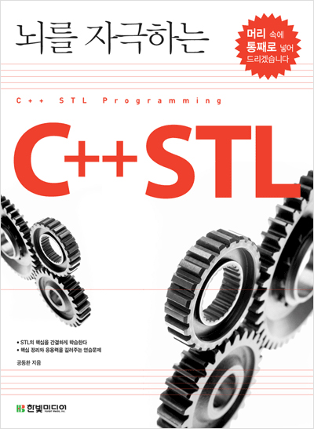

# C++ STL Programming

## 💡프로젝트의 목적 과 구성
- 본 프로젝트는 C++ STL 학습을 위한 프로젝트 입니다.
- 본 프로젝트는 STL 이론과 구현 코드로 작성중입니다.
- 코드는 모두 C++언어로 작성합니다.
- 학습용 프로젝트이기 때문에 일부 오류가 포함되어 있을 수 있습니다.
- 본 프로젝트는 한빛 미디어의 `뇌를 자극하는 C++ STL` 교재를 참고하여 작성하였습니다.

## 📝프로젝트 목차

#### Part1. 
> STL을 학습하기 전 꼭 알아야 하는 C++ 문법
- [1장 연산자 오버로딩](https://github.com/choisb/Study-Cpp-STL/tree/master/Ch01_Operator_Overloading#Operator-Overloading) 
- [2장 함수 포인터](https://github.com/choisb/Study-Cpp-STL/tree/master/Ch02_Function_Pointer#Function-Pointer)
- [3장 함수 객체](https://github.com/choisb/Study-Cpp-STL/tree/master/Ch03_Function_Object#function-object) 
- [4장 템플릿](https://github.com/choisb/Study-Cpp-STL/tree/master/Ch04_Template#Tamplate) 

#### Part2.
> STL 이해하기
- [5장 STL 소개]()
- 6장 시퀀스 컨테이너
- 7장 연관 컨테이너
- 8장 알고리즘
- 9장 STL 함수 객체
- 10장 반복자
- 11장 컨테이너 어댑터
- 12장 string 컨테이너
___
## 출처

- 본 프로젝트는 개인 학습을 목적으로 공동환 저자의 [뇌를 자극하는 C++ STL](한빛 미디어) 교재 내용을 요약 및 일부 수정하여 작성하였습니다.
- 본 프로젝트의 내용과 코드에 대한 저작권은 공동환과 한빛미디어(주)에 있으며, 한빛미디어(주)로 부터 허가를 받고 게시하였음을 밝힙니다.
- [도서 소개보기](https://www.hanbit.co.kr/store/books/look.php?p_code=B5912645820)
